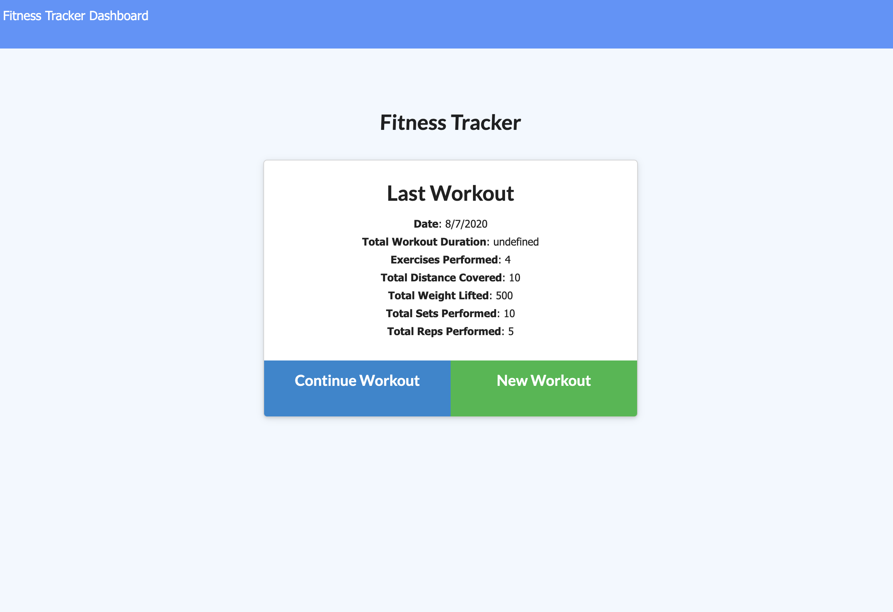
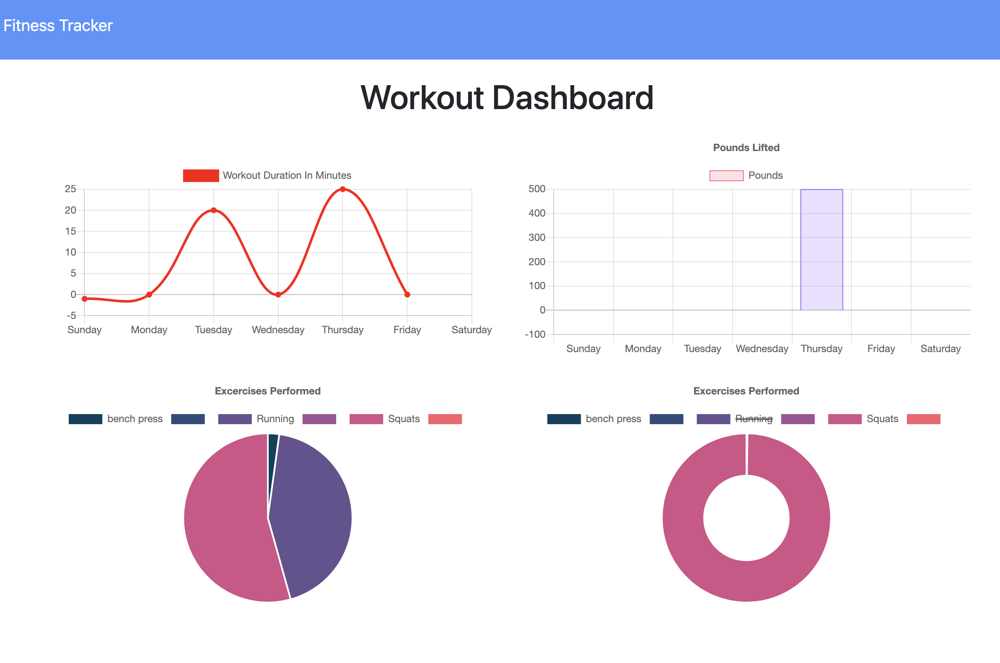

# 17-workout-tracker

This is an application that allows the user to create a workout tracker using a Mongo database with Mongoose schema with routes using Express.





## Deployed Link

* [See Live Site](https://gnoisy.github.io/17-workout-tracker/)

## Prerequisites

You'll need an IDE such as VS Code or Atom. Copy and paste code into your IDE and you can save file to your local drive.

```
https://code.visualstudio.com/download

https://flight-manual.atom.io/getting-started/sections/installing-atom/
```

## Installing

- Clone the repository : https://github.com/GNoisy/17-workout-tracker


## Built With

* [Javascript](https://developer.mozilla.org/en-US/docs/Web/JavaScript)
* [Node.js](https://nodejs.org/en/)
* [MongoDB](https://www.mongodb.com/)
* [Mongoose](https://mongoosejs.com/)
* [Express](https://expressjs.com/)


## Author

* **Giovanni Noisy**

- [Github](https://github.com/GNoisy)
- [LinkedIn](https://www.linkedin.com/in/giovanni-noisy-04098989/)

### Acknowledgments

* MDN 
* w3schools